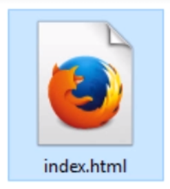
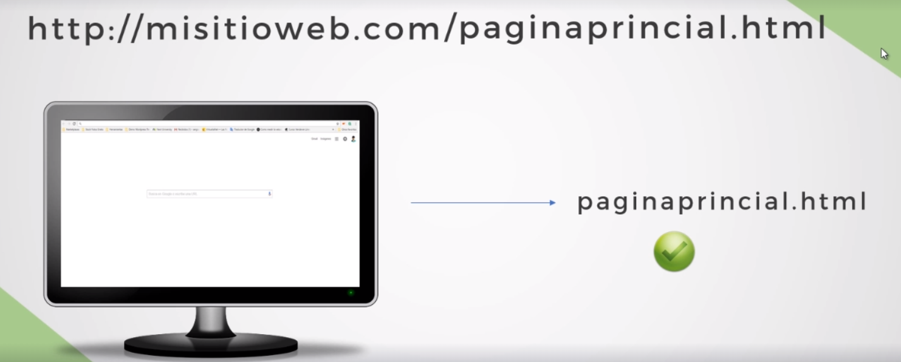
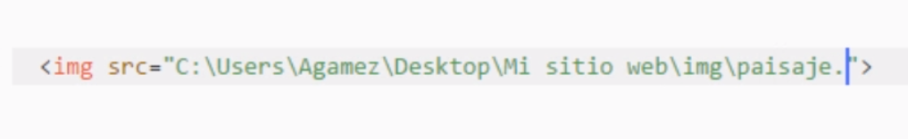
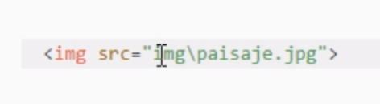
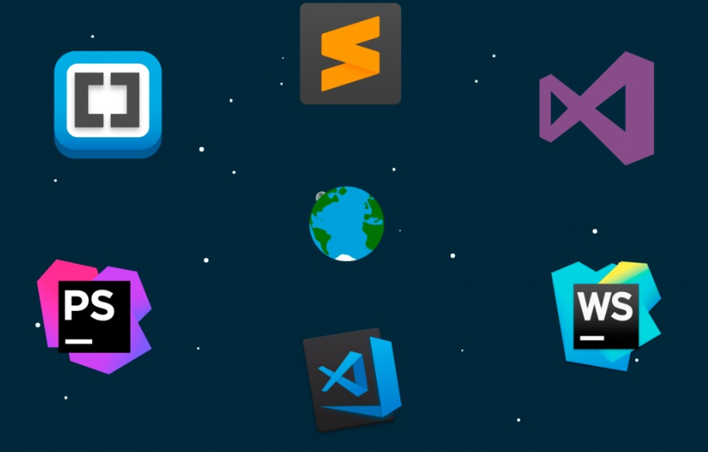

# ARCHIVOS
* Se crea una carpeta que va a contener toda nuestra documentación.

## Archivo base

* Este archivo es standard para que el navegador pueda iniciar su busqueda.

ejemplo:

* Otra forma muy poco usada es escribir el nombre del archivo seguido de la direccion web asi:

* Es importante nombrar los archivos con sus respectivos nombres para manejar una documentación organizada y no se recomiendan los caracteres especiales.

* Tambien es primordial tener unas rutas de archivos bien organizadas, es decir si vamos a manejar archivos de imagenes, podemos crear una capeta imagenes u img.

## RUTAS ABSOLUTAS     /// RUTAS RELATIVAS

* las Url de la web son son rutas absulutas ya que se necesita toda la direccion Url para hacer la referencia, para archivos bien indexados lo mejor es utiliar rutas relativas por si se mueve el archivo de carpte o desactivan la Url de la web, el archivo siga funcionando.

***RUTA ABSOLUTA***

***RUTA RELATIVA***

## EDITORES DE TEXTO
Puedes escribir código en cualquier editor de texto, aunque hay algunos que ofrecen más ventajas que el simple block de notas, entre editores recomendados estan VSC, Atom,etc.

[https://julianortiz6605.github.io/-2-Organizacion-de-Archivos/]

